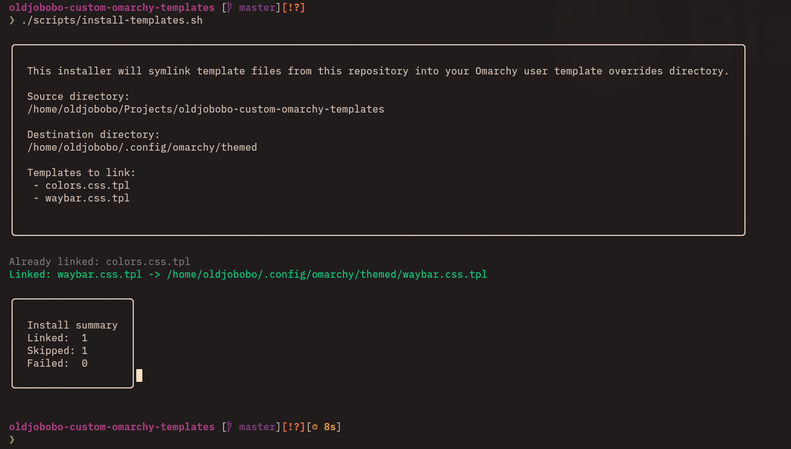

# Omarchy Templates

User-facing Omarchy template overrides and ready-to-copy examples.

## Why this exists

Omarchy themes store colors in `colors.toml`, but many GTK-based layer-shell clients style from GTKCSS.
This repo bridges that gap by rendering theme values into GTKCSS so those clients can stay synced with the active theme.

Current implementation target:

- Waybar, via the provided `waybar.css.tpl` template.

## What you get

- `colors.css.tpl`: Theme color template Omarchy renders into `colors.css`.
- `waybar.css.tpl`: Waybar-ready example for GTK layer-shell color usage.
- `examples/tilebar-v1`: Tilebar example (`config.jsonc` + `style.css`).

## Install

### Install (recommended)

Links all `*.tpl` files from this repo into `~/.config/omarchy/themed/`.

```bash
./scripts/install-templates.sh
```



- Requires `gum` in `PATH`.
- Prompts on conflicts: `Replace`, `Skip`, or `Abort`.

### Install (manual)

Copy or link template files (`*.tpl`) from this repo into:

- `~/.config/omarchy/themed/`

Then apply/switch a theme. Omarchy renders to:

- Output file: `~/.config/omarchy/current/theme/colors.css`

## Typical usage

1. Edit `colors.css.tpl`.
2. Apply a theme (`omarchy-theme-set <theme>` or your normal theme workflow).
3. Check `~/.config/omarchy/current/theme/colors.css`.
